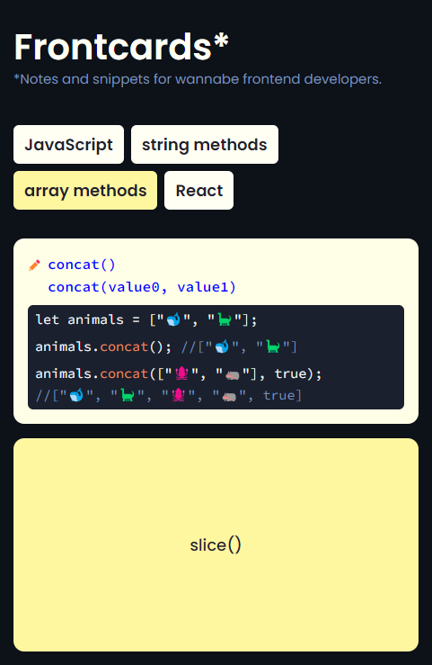
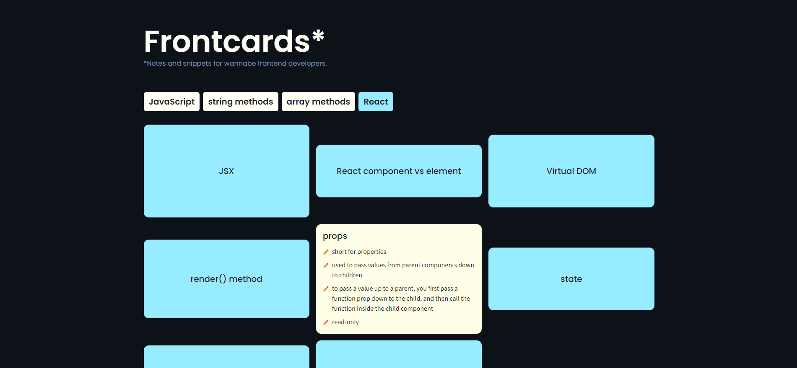

# Frontcards

This is a plain HTML, CSS and JavaScript app that renders a grid of flashcards for each selected frontend category. Rotated cards show notes and/or code snippets. All data has been stored in an additional .js file.

Originally the app was meant as a private, self-education project that would help me organize my frontend-related notes. Over time, it evolved from a vanilla JavaScript playground into a slightly larger Next.js app ([see the new repo](https://github.com/double-vee/next-frontcards)).

## Screenshots

### Mobile view:

### Grid view:

